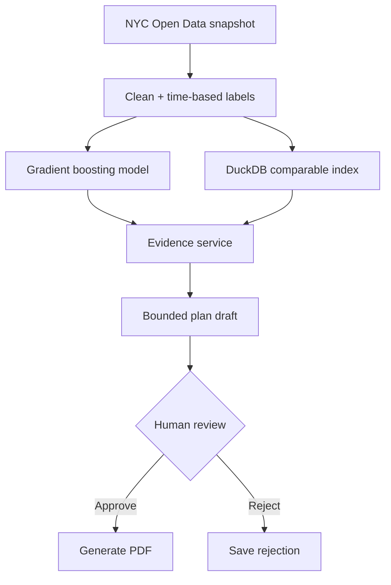

# PermitPulse AI

PermitPulse AI estimates whether an NYC construction permit is likely to be
issued before a project target date, retrieves comparable historical permits,
and proposes an administratively valid next step for project-manager approval.

## Current checkpoint: portfolio release v1

Stage 0 established data viability and Stage 1 built the reproducible dataset.
Stage 2 selected gradient boosting on a future-period test set. Stage 3 adds
local sensitivity, comparable completed filings, and data-quality warnings.
Stage 4 adds a LangGraph workflow that drafts a bounded checklist and pauses for
human review. Stage 5 exposes the workflow through FastAPI, a Streamlit dashboard,
Docker Compose, and CI. Stage 6 adds durable checkpoints, workspace history, a
human-approved PDF report, and a verified runtime-artifact bundle.



## macOS + VS Code setup

```bash
git clone <your-repository-url>
cd permitpulse-ai
python3 -m venv .venv
source .venv/bin/activate
python -m pip install --upgrade pip
python -m pip install -r requirements.txt
python -m unittest discover -v

# Fast development proof: download and clean 5,000 live rows
python -m src.data.build_dataset --observation-date 2026-08-26 --max-rows 5000

# Full snapshot: omit --max-rows (this may take several minutes)
python -m src.data.build_dataset --observation-date 2026-08-26

# Train/evaluate Model v1 with its input profile
python -m src.modeling.train

# Build the local comparable-case index and run one real assessment
python -m src.retrieval.comparables
python -m src.services.demo
```

## Run the finished application

The model artifact must be retrained after pulling Stage 3+ because it now stores
its input profile. Keep these two terminals open:

```bash
# Terminal 1
source .venv/bin/activate
python -m uvicorn src.api.app:app --reload

# Terminal 2
source .venv/bin/activate
python -m streamlit run ui.py
```

Open `http://localhost:8501`. Interactive API documentation is at
`http://localhost:8000/docs`.

Gemini is optional. Without an API key, the same workflow uses deterministic
wording. To enable it, set `GOOGLE_API_KEY` in your shell or `.env` environment.
Gemini can rewrite the summary only; the score, evidence, actions, and approval
state remain controlled by code.

Configuration is loaded automatically from the repository-root `.env` file; you
do not need to source it manually before starting FastAPI or Streamlit.

## Durable workspace history

Enter a demo workspace ID in the Streamlit sidebar. It groups prior assessments,
and clicking a history item reopens its result. LangGraph checkpoints and history
are stored in `artifacts/permitpulse_state.sqlite`, so a pending approval can be
resumed after FastAPI restarts.

Workspace IDs are demo separation, not authentication. Do not enter private or
sensitive project data. Use real authentication plus a shared database before any
multi-user deployment.

## Human-approved PDF

The UI shows the risk, evidence, warnings, and checklist before the reviewer decides.
Approval generates a polished PDF containing that reviewed context and exposes a
workspace-scoped download button. Rejection records the decision and creates no PDF.
Reports are stored under `artifacts/reports/`, which is covered by the same Docker
volume as the SQLite checkpoint.

See the committed [sample approved assessment](output/pdf/permitpulse-sample-assessment.pdf)
for the exact report a reviewer receives.

## Reviewer quick-start artifacts

Runtime artifacts are intentionally excluded from Git. Build the release archive:

```bash
python scripts/manage_demo_artifacts.py build permitpulse-demo-artifacts.tar.gz
```

Attach it to a GitHub Release. A reviewer can download it and run:

```bash
python scripts/manage_demo_artifacts.py install permitpulse-demo-artifacts.tar.gz
```

Docker is also supported after local artifacts have been generated:

```bash
docker compose up --build
```

Stage 1 stores compressed outputs under `data/`. These large reproducible files
are excluded from Git; their manifest records provenance, cleaning results,
the feature policy, and cryptographic hashes.

Optional: copy `.env.example` to `.env`, add a Socrata app token, and export it
before running the audit. Never commit `.env`.

## Scope boundary

This is a planning-support tool. It does not determine code compliance,
predict examiner objections, guarantee issuance dates, or replace a licensed
professional or DOB examiner.

## Stage 1 rules worth defending

- The API supplies the raw facts; our code only selects, cleans, and labels.
- Every repeated `job_filing_number` is quarantined. There are very few, and
  guessing which conflicting row is correct would be harder to defend.
- A missing permit is a negative for a 30-day target only after 30 days have
  elapsed. More recent unresolved filings remain censored and are not trained
  as failures.
- Outcome and post-filing status fields never enter the model feature list.
- Applicant names, exact addresses, and license numbers are not downloaded
  because the initial model does not need them.

## Stage 2 rules worth defending

- The positive class is delay risk: no first permit within 30 days.
- 2016–2023 trains the models, 2024 chooses the model and threshold, and
  2025 through the mature 2026 cutoff is reserved for final testing.
- The alert threshold is selected only on validation data and must catch at
  least 80% of delayed filings.
- ML competes against a transparent historical rate grouped by borough, job
  type, and review type; ML is not assumed to win.
- Generated model artifacts stay local under `artifacts/`; reproducible metrics
  and reports are committed.

## Stage 3 rules worth defending

- Online requests containing post-outcome fields are rejected.
- Local sensitivity replaces one field at a time with its training reference;
  it is not presented as causal or additive.
- Comparable retrieval is parameterized, excludes the current filing, and
  relaxes its matching scope only when strict matches are insufficient.
- Comparable processing-time summaries include completed cases only and are
  evidence, not a guarantee of approval timing.
- Missing, unseen, extreme, and post-training inputs produce explicit warnings.

## Product workflow rules worth defending

- The LLM never calculates or changes the risk score.
- LangGraph pauses before finalization and requires `approve` or `reject` on the
  same thread.
- Approval authorizes only a downloadable PDF from the displayed assessment; the
  system never contacts DOB or changes a project schedule automatically.
- A durable SQLite checkpointer supports restart recovery for this single-instance demo. A
  durable shared checkpointer is still required for multi-instance deployment.
- See `reports/project_guide.md` for a plain-English walkthrough and
  `reports/stage6_portfolio.md` for the final persistence and PDF boundaries.
