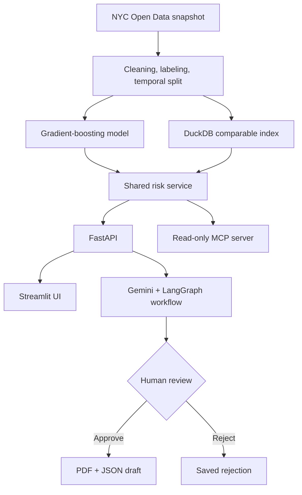
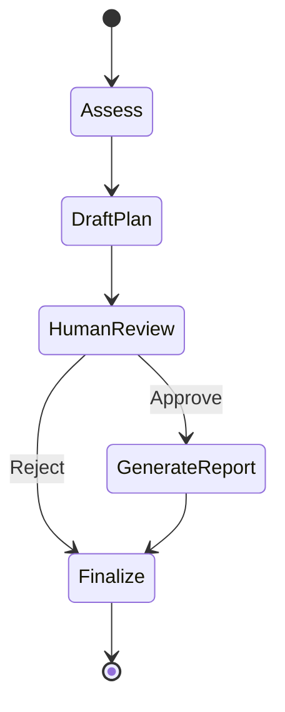

# PermitPulse AI

**An evidence-backed, human-in-the-loop permit schedule-risk platform built on approximately 946,000 official NYC Department of Buildings filings.**

PermitPulse helps construction teams answer a focused planning question:

> Which permit filings are most likely to miss a 30-day first-permit target, and which ones should the team investigate first?

The application combines temporal machine-learning evaluation, comparable-case retrieval, Gemini tool use, durable LangGraph approval, portfolio prioritization, PDF reporting, and a read-only MCP interface. The model produces the risk signal; deterministic services produce the evidence; Gemini improves document and conversational interaction; a person remains responsible for every decision.

> **Planning support only:** PermitPulse does not determine compliance, predict examiner objections, guarantee permit issuance, submit a filing, change a project schedule, or write to an external construction platform.


## Why this project exists

A construction project manager may be tracking several permit-dependent milestones while having time to investigate only a small number of filings. A raw probability does not solve that workflow. The user also needs to know:

- Which filing should be reviewed first?
- What historical evidence supports the score?
- Which inputs influenced this particular assessment?
- Who owns the mitigation?
- Was the recommendation reviewed by a person?
- Can the reviewed result be handed to another system without copying an LLM response?

PermitPulse turns an external municipal dataset into a ranked, evidence-backed review workflow. It does **not** claim that displaying a prediction will itself reduce permit time. The product hypothesis still requires validation with construction project managers, architects, and permit professionals.

## What users can do

### Assess one permit

Users can enter filing characteristics manually and receive:

- Probability of missing the 30-day first-permit target
- Low, moderate, or high planning-risk label
- Local input-sensitivity factors
- Similar completed NYC filings and observed processing times
- Data-quality and out-of-distribution warnings
- A deterministic or Gemini-assisted mitigation checklist
- A durable Gemini follow-up conversation grounded in PermitPulse tools

### Upload one document

With Gemini configured, users can upload one PDF, PNG, or JPEG. PermitPulse:

1. Validates the file size, declared MIME type, and binary file signature.
2. Uses `pypdf` to create a bounded text preview for PDFs.
3. Sends both the preview and original document bytes to Gemini for multimodal extraction.
4. Requests a strict JSON structure containing only supported fields.
5. Normalizes extracted categories against the model's accepted values.
6. Leaves missing core values unresolved instead of guessing them.
7. Requires the user to review and confirm every value before assessment.

The extraction step is an intake assistant, not an authority. Gemini never submits the document or bypasses user confirmation.

### Prioritize a portfolio

Users can load six demonstration projects or upload a CSV containing up to 25 filings. The six examples are only a convenient demo seed; they are not an input requirement.

The portfolio is ordered by:

1. Risk level
2. Earliest permit-needed date
3. Delay probability

The dashboard also displays project ownership, review status, comparable processing time, and missing mitigation owners.

### Review and export

LangGraph pauses each assessment for an explicit human decision:

- **Approve:** generate a reviewed PDF and an integration-ready JSON draft.
- **Reject:** preserve the rejection and reviewer note without creating an approved artifact.

Approval means that a person reviewed the planning assessment. It does not mean that the NYC Department of Buildings approved the filing.

## End-to-end architecture



### Why each component exists

| Component                      | Responsibility                                                                         | Design rationale                                                                                   |
| ------------------------------ | -------------------------------------------------------------------------------------- | -------------------------------------------------------------------------------------------------- |
| scikit-learn gradient boosting | Predict 30-day first-permit delay risk                                                 | Strong fit for mixed structured tabular data without unnecessary deep-learning infrastructure      |
| FastAPI                        | API contracts for assessment, history, chat, review, reports, and portfolio operations | Keeps the UI, MCP interface, and future integrations separate from model implementation            |
| Streamlit                      | Interactive single-assessment and portfolio experience                                 | Provides a complete, low-cost demonstration without a large frontend codebase                      |
| DuckDB                         | Retrieve and summarize comparable completed filings                                    | Efficient analytical queries over local columnar data without deploying another database service   |
| Gemini                         | Extract candidate fields, select evidence tools, and answer grounded questions         | Adds value where language and unstructured input matter without becoming the source of model facts |
| LangGraph                      | Run the stateful assess-plan-review-report workflow                                    | Supports durable interruption and resumption around human approval                                 |
| SQLite                         | Store assessments, review state, agent chat, and LangGraph checkpoints                 | Lightweight persistence for a single-instance local or portfolio demo                              |
| ReportLab                      | Generate the approved PDF                                                              | Produces a portable, auditable artifact rather than leaving the decision in an ephemeral chat      |
| MCP                            | Expose the tested risk services as read-only AI tools                                  | Allows compatible clients to reuse the system without duplicating model logic                      |

## What makes the workflow agentic

PermitPulse is best described as an **agentic ML workflow**, not a multi-agent platform.

The responsibilities remain deliberately separated:

- **Machine learning** calculates the risk probability.
- **DuckDB and deterministic code** retrieve evidence and construct factual context.
- **Gemini** decides which bounded evidence tools to call and translates their output into natural language.
- **Numeric grounding checks** reject unsupported numerical claims.
- **LangGraph** manages workflow state and the human-review boundary.
- **The user** approves or rejects the assessment.

For a follow-up question, the system:

1. Loads up to eight prior user/assistant messages for conversational continuity.
2. Treats those messages as untrusted context, not factual evidence.
3. Requires Gemini to call a PermitPulse evidence tool.
4. Checks the response's numerical claims against the frozen tool output.
5. Stores the user message, answer, and tool trace in SQLite.

If Gemini is unavailable, manual and portfolio scoring continue through deterministic services. Gemini cannot alter the score, comparable records, approval state, or generated report logic.

## Data and target definition

### Source

PermitPulse uses the official NYC Open Data **DOB NOW: Build – Job Application Filings** dataset, Socrata identifier [`w9ak-ipjd`](https://data.cityofnewyork.us/resource/w9ak-ipjd.json).

The reproducible snapshot was extracted on **2026-08-26** and contained approximately **945,789 raw filings**. After cleaning, label-maturity rules, and temporal splitting, **932,139 rows** were used across model development and testing.

### Prediction target

The binary target is:

```text
1 = first permit was not issued within 30 days of filing
0 = first permit was issued within 30 days of filing
```

For unresolved filings, a positive delay label is assigned only after the full 30-day observation window has matured. Recent unresolved filings remain censored and are excluded rather than being incorrectly labeled.

The 30-day horizon is a clear, testable planning hypothesis. It is not claimed to be the correct operational threshold for every contractor or jurisdiction. A production discovery process should validate the horizon or replace it with multi-horizon or survival estimates.

### Leakage controls

The model uses only fields intended to be available around filing time. Outcome fields such as the first-permit date are excluded from the feature set. Exact addresses, names, and license numbers are also excluded.

Data is split chronologically rather than randomly:

| Split          | Date range               |    Rows | Delay rate |
| -------------- | ------------------------ | ------: | ---------: |
| Training       | 2016-08-04 to 2023-12-31 | 527,508 |      62.8% |
| Validation     | 2024-01-01 to 2024-12-31 | 155,966 |      66.4% |
| Untouched test | 2025-01-01 to 2026-07-27 | 248,665 |      70.5% |

The future-period test better represents deployment than a random split in which older and newer operating conditions are mixed.

## Model development and evaluation

PermitPulse evaluates three progressively stronger approaches:

- Grouped historical delay-rate baseline
- Logistic regression
- Gradient boosting

The classification threshold is selected using validation data with a minimum 80% delay-recall requirement. The untouched future-period results are:

| Model                    |   ROC AUC | Average precision | Delay precision | Delay recall |  Delay F1 | Brier score |
| ------------------------ | --------: | ----------------: | --------------: | -----------: | --------: | ----------: |
| Historical-rate baseline |     0.788 |             0.896 |           77.9% |        84.8% |     81.2% |       0.158 |
| Logistic regression      |     0.859 |             0.939 |           88.0% |        80.9% |     84.3% |       0.142 |
| **Gradient boosting**    | **0.869** |         **0.944** |       **88.8%** |    **80.7%** | **84.5%** |   **0.136** |

The selected gradient-boosting threshold is **0.53**. Expected calibration error across test-period risk deciles is **0.053**.

These are retrospective metrics. They demonstrate ranking and discrimination on future-period data; they do not prove that a project intervention will shorten a permit timeline.

See [model methodology](reports/stage2_model.md) and the machine-readable [model metrics](reports/model_metrics.json).

## Operational portfolio evaluation

Model metrics do not directly answer whether the system helps a busy project team. PermitPulse therefore simulates a limited-capacity review process in which the team can investigate only the highest-ranked 20% of future-period filings.

| Ranking strategy         | Filings reviewed |    Delays found | Delays per 100 reviews | Share of all delays found |
| ------------------------ | ---------------: | --------------: | ---------------------: | ------------------------: |
| Random expected          |           49,733 | 35,042 expected |                   70.5 |                     20.0% |
| Historical-rate baseline |           49,733 |          48,548 |                   97.6 |                     27.7% |
| **PermitPulse**          |       **49,733** |      **49,418** |               **99.4** |                 **28.2%** |

`99.4 delays per 100 reviews` is precision within the prioritized review queue, not 99.4% overall model accuracy. The high value partly reflects the 70.5% test-period base delay rate.

The improvement over the strong historical baseline is real but modest. This suggests that richer project-specific signals and workflow adoption may add more value than simply trying additional model families.

See the [portfolio evaluation](reports/portfolio_evaluation.md) for calibration, subgroup results, and false-negative analysis.

## Explanations and historical evidence

### Local sensitivity

For one assessment, PermitPulse replaces an input with its training-reference value and measures the change in predicted risk. This indicates which inputs the prediction is locally sensitive to.

It is deliberately labeled as **non-causal and non-additive**. It does not prove that changing a field will change the real permit outcome.

### Comparable filings

DuckDB retrieves similar completed filings using fields such as borough, job type, and review type. When an exact combination returns too few records, the retrieval policy relaxes the match in a controlled order.

Comparable processing times include only filings with an observed first permit. That creates completed-case selection bias, so the records are supporting evidence rather than a timing guarantee.

## Human-in-the-loop workflow

The LangGraph state machine follows:



The SQLite LangGraph checkpointer allows an interrupted assessment to resume after an API restart in a single-instance deployment. Assessment history and agent conversations are also stored by workspace and thread ID.

Workspace IDs provide demo record separation only. They are not authentication, authorization, or secure tenant isolation.

## Read-only MCP service

PermitPulse exposes the same tested service layer through MCP:

| MCP tool                      | Purpose                                                                                     | External write |
| ----------------------------- | ------------------------------------------------------------------------------------------- | -------------- |
| `assess_permit_risk`          | Assess one filing and return prediction, evidence, sensitivity, warnings, and model context | No             |
| `find_comparable_permits`     | Retrieve similar completed filings and processing-time summaries                            | No             |
| `prioritize_permit_portfolio` | Rank 1–25 filings for human review                                                        | No             |

The server also exposes model-card and portfolio-evaluation resources. All tools are annotated read-only, idempotent, non-destructive, and closed-world. There is intentionally no tool for approving an assessment, sending email, submitting a permit, changing a schedule, or writing to an external platform.

Run the MCP server locally over standard input/output:

```bash
python -m src.mcp.server
```

Example client configuration:

```json
{
  "mcpServers": {
    "permitpulse": {
      "command": "/absolute/path/permitpulse-ai/.venv/bin/python",
      "args": ["-m", "src.mcp.server"],
      "cwd": "/absolute/path/permitpulse-ai"
    }
  }
}
```

For local Streamable HTTP testing:

```bash
python -m src.mcp.server --transport streamable-http --host 127.0.0.1 --port 8003
```

Connect an MCP client to `http://localhost:8003/mcp`.

## Technology stack

| Layer                  | Technology                                         |
| ---------------------- | -------------------------------------------------- |
| Data processing        | Python, pandas, NYC Socrata API                    |
| Machine learning       | scikit-learn, joblib                               |
| Analytical retrieval   | DuckDB                                             |
| Agent and workflow     | Gemini 2.5 Flash, LangGraph                        |
| API                    | FastAPI, Uvicorn                                   |
| User interface         | Streamlit                                          |
| Persistence            | SQLite, LangGraph SQLite checkpointer              |
| Agent interoperability | Model Context Protocol                             |
| Reports                | ReportLab, Matplotlib                              |
| Testing and delivery   | unittest, Docker, GitHub Actions, Render Blueprint |

PyTorch and TensorFlow are intentionally not used. The prediction problem is structured tabular classification, for which a smaller gradient-boosting pipeline is faster to train, easier to host, and easier to defend.

## Run locally

### Prerequisites

- Python 3.12
- Git
- Runtime model artifacts or the ability to reproduce them
- Optional Gemini API key for document intake and agent conversations

### 1. Clone and install

```bash
git clone https://github.com/ivky03/permitpulse-ai.git
cd permitpulse-ai

python3 -m venv .venv
source .venv/bin/activate
python -m pip install --upgrade pip
python -m pip install -r requirements.txt
```

On Windows PowerShell, activate with:

```powershell
.venv\Scripts\Activate.ps1
```

### 2. Install or reproduce runtime artifacts

Model binaries and the DuckDB comparable index are intentionally excluded from Git.

To install a verified artifact bundle downloaded from a GitHub Release:

```bash
python scripts/manage_demo_artifacts.py install permitpulse-demo-artifacts.tar.gz
```

The bundle contains only the expected runtime artifacts, and the installer verifies SHA-256 hashes before installation.

Alternatively, reproduce the full pipeline:

```bash
python -m src.data.build_dataset --observation-date 2026-08-26
python -m src.modeling.train
python -m src.retrieval.comparables
python -m src.modeling.portfolio_evaluation
```

For a faster ingestion proof using 5,000 records:

```bash
python -m src.data.build_dataset --observation-date 2026-08-26 --max-rows 5000
```

The small sample verifies the data path but is not the reported final model.

### 3. Configure environment variables

Copy the example configuration:

```bash
cp .env.example .env
```

For the complete local agent experience, set:

```text
GOOGLE_API_KEY=your_key
GEMINI_MODEL=gemini-2.5-flash
PERMITPULSE_API_URL=http://localhost:8000
```

Gemini is optional for deterministic manual and portfolio assessment. It is required for PDF/image intake, Gemini-generated planning language, tool traces, and follow-up chat. Never commit `.env`.

### 4. Run the tests

```bash
python -m unittest discover -v
```

The current suite contains **43 tests** covering:

- Dataset cleaning and label maturity
- Leakage-field rejection
- Temporal splitting and threshold policy
- Risk-service and comparable-retrieval behavior
- LangGraph pause, approval, rejection, and restart recovery
- PDF and integration-draft approval gates
- Workspace isolation and history
- Portfolio ranking and limits
- MCP contracts and read-only annotations
- Gemini tool grounding and unsupported-number rejection
- Document signature, schema, and missing-field handling
- Durable multi-turn agent chat

### 5. Start the API

```bash
python -m uvicorn src.api.app:app --reload --port 8000
```

Useful endpoints:

- Health check: `http://localhost:8000/health`
- Interactive API documentation: `http://localhost:8000/docs`

### 6. Start the UI

In a second terminal:

```bash
source .venv/bin/activate
PERMITPULSE_API_URL=http://localhost:8000 python -m streamlit run ui.py
```

Open `http://localhost:8501`.

If port 8000 is already occupied, start FastAPI on another port and pass the same URL to Streamlit:

```bash
# Terminal 1
python -m uvicorn src.api.app:app --reload --port 8002

# Terminal 2
PERMITPULSE_API_URL=http://localhost:8002 python -m streamlit run ui.py
```

## Suggested demonstration

1. Open a demo workspace.
2. Create one permit assessment manually or upload a labeled sample document.
3. Confirm all extracted values before assessment.
4. Review the risk, local sensitivity, comparables, warnings, and agent tool trace.
5. Ask two grounded follow-up questions to demonstrate durable multi-turn chat.
6. Reject one assessment and show that no approved artifact is produced.
7. Approve another assessment and download the PDF and JSON draft.
8. Open the portfolio view, load six examples, and explain the ranking policy.
9. Briefly show the operational evaluation and read-only MCP tools.

See the [five-minute demo script](reports/demo_script.md) and [sample approved PDF](output/pdf/permitpulse-sample-assessment.pdf).

## Agent evaluation

The normal test suite validates deterministic agent contracts without spending Gemini tokens. After setting `GOOGLE_API_KEY`, run the live evaluation separately:

```bash
python -m scripts.evaluate_agent
```

The live suite covers:

- Risk explanation and required tool use
- Historical-evidence retrieval
- Mitigation-focused follow-up
- Rejection of unsupported numerical claims
- A direct prompt-injection attempt
- Exact extraction of six core fields from a labeled synthetic PDF

Results are written to:

- `reports/agent_evaluation.md`
- `artifacts/agent_evaluation.json`

The checked-in report is a methodology placeholder until the live command is run. Do not claim a live Gemini pass rate from the deterministic contract tests alone.

## Public demo deployment

`render.yaml` defines three independent services:

- `permitpulse-api`
- `permitpulse-ui`
- `permitpulse-mcp`

Deployment steps:

1. Build the runtime bundle:

   ```bash
   make bundle
   ```

2. Attach `permitpulse-demo-artifacts.tar.gz` to a GitHub Release.
3. Connect the repository to Render as a Blueprint.
4. Set `PERMITPULSE_ARTIFACT_BUNDLE_URL` for the API and MCP services.
5. Set `PERMITPULSE_API_URL` for the UI service.
6. Verify `/health`, the Streamlit workflow, PDF download, JSON download, and the MCP endpoint.

The anonymous public configuration intentionally disables paid Gemini usage. It also limits portfolio size, rate-limits mutating API calls, and generates anonymous workspace IDs.

Free Render filesystems are ephemeral, so assessment history and generated reports may disappear after restart or redeployment. That is acceptable for an anonymous portfolio demonstration, not a production multi-tenant system.

## Repository structure

```text
permitpulse-ai/
      src/
        agent/          # Gemini intake, grounding, and LangGraph workflow
        api/            # FastAPI application and contracts
        data/           # Socrata client, audit, cleaning, and labeling
        mcp/            # Read-only MCP server
        modeling/       # Baseline, training, evaluation, and calibration
        retrieval/      # DuckDB comparable-permit index
        services/       # Risk, portfolio, persistence, PDF, and adapter services
        scripts/            # Runtime artifact management and live agent evaluation
        tests/              # Unit, workflow, API, agent, MCP, and persistence tests
        reports/            # Model card, evaluations, product brief, and stage notes
        output/pdf/         # Checked-in sample approved report
        ui.py               # Streamlit application
        render.yaml         # Public demo Blueprint
        Dockerfile
        Makefile
```

## Known limitations

### Product validation

The workflow has not yet been validated through formal interviews with construction project managers or permit professionals. The current work demonstrates technical feasibility, not product-market fit.

### Geographic generalization

NYC is the only evaluated market. Other jurisdictions require new source adapters, schema mapping, outcome definitions, retraining, calibration, and local validation.

### Completed-case selection bias

Comparable processing-time evidence includes only filings with observed first permits. Unresolved filings are not represented in comparable duration summaries.

### Fixed prediction horizon

The current model answers only whether a filing misses 30 days. Survival analysis or multi-horizon predictions would handle unresolved outcomes and planning windows more naturally.

### Subgroup performance

Professional Certification recall is **46.2%**, compared with **97.5%** for Standard Plan Examination. The model should not be deployed without targeted error analysis, calibration monitoring, and domain review.

At the frozen threshold, the model missed **33,795** actually delayed future-period filings. A low-risk score must never be interpreted as a guarantee.

### Explanation limits

Local sensitivity and comparable cases are supporting evidence, not causal explanations. Recommended actions have not been shown to cause faster permit issuance.

### Prototype persistence and security

SQLite and workspace IDs are appropriate for a local single-instance demonstration. They are not sufficient for secure multi-user production use. Do not enter confidential or customer-sensitive project information.

### External integration

The JSON output is a draft contract only. PermitPulse does not perform an external write. A production integration requires OAuth, authorization, validated field mappings, audit logging, retries, and a customer-approved sandbox.

## Production roadmap

The highest-value next steps are:

1. Conduct discovery interviews with construction PMs, architects, and permit specialists.
2. Validate the prediction horizon, review capacity, ownership model, and intervention workflow.
3. Add outcome monitoring that links each prediction to the subsequently observed first permit.
4. Evaluate survival or multi-horizon models and recalibration over time.
5. Improve Professional Certification recall and investigate false negatives.
6. Replace demo workspace IDs with authentication, role-based authorization, and tenant isolation.
7. Move state to managed Postgres/shared LangGraph checkpoints and reports to object storage.
8. Add production observability for data drift, model calibration, agent grounding, latency, and token cost.
9. Validate an external-platform adapter through an authorized sandbox before enabling writes.

## Supporting documentation

- [Product brief](reports/product_brief.md)
- [Project and architecture guide](reports/project_guide.md)
- [Portfolio evaluation](reports/portfolio_evaluation.md)
- [MCP contract evaluation](reports/mcp_evaluation.md)
- [Agent evaluation methodology](reports/agent_evaluation.md)
- [Five-minute demo script](reports/demo_script.md)
- [Sample approved PDF](output/pdf/permitpulse-sample-assessment.pdf)

## Responsible-use summary

PermitPulse demonstrates how external public data can become a measurable, evidence-backed schedule-risk signal while preserving a clear human-control boundary. Its most important design choice is not the use of an LLM; it is the separation of responsibilities between predictive modeling, deterministic evidence, language interaction, durable workflow state, and human judgment.
