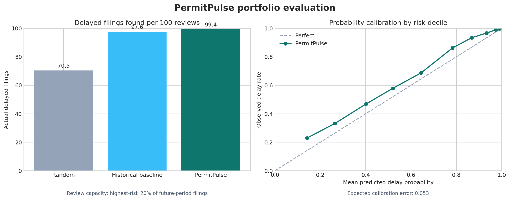
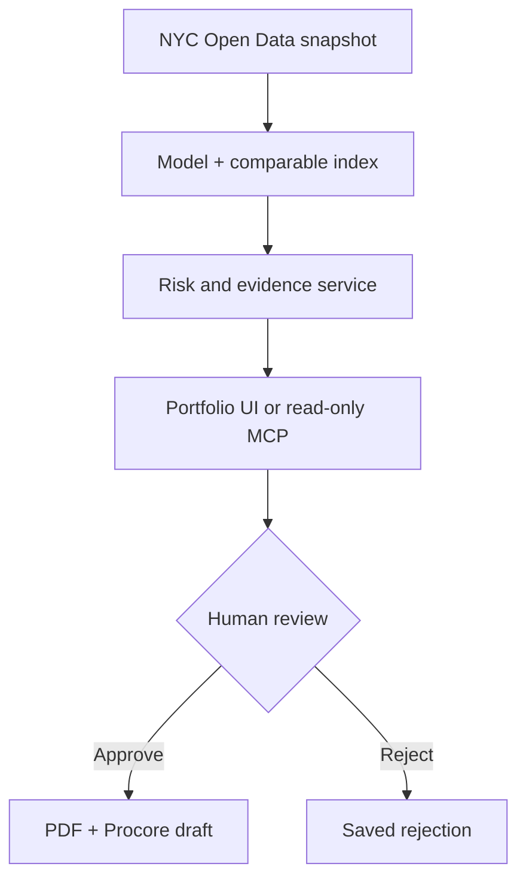

# PermitPulse AI

PermitPulse helps construction teams decide **which permit filings deserve attention
first**. It estimates the risk that an NYC DOB filing will miss a 30-day first-permit
target, retrieves comparable completed filings, drafts a grounded mitigation checklist,
and pauses for human approval before producing a PDF or Procore-shaped risk draft.

> Planning support only. PermitPulse does not determine compliance, predict examiner
> objections, guarantee issuance, submit a filing, or write to Procore.



## Why this project exists

A project manager may have many upcoming permit-dependent milestones and limited time
to investigate them. A raw model score is not enough. PermitPulse turns that score into
a review queue with evidence, ownership, a needed-by date, an approval boundary, and a
portable downstream record.

On the untouched 2025-2026 test period, reviewing the highest-risk 20% found:

| Ranking strategy | Actual delays per 100 reviews | Share of all delays found |
| --- | ---: | ---: |
| Random expected | 70.5 | 20.0% |
| Historical-rate baseline | 97.6 | 27.7% |
| PermitPulse | **99.4** | **28.2%** |

The incremental gain over the strong baseline is modest, not hidden. The model is most
useful as a calibrated prioritization and evidence workflow, not as autonomous AI.
See the [full portfolio evaluation](reports/portfolio_evaluation.md).

The largest known subgroup weakness is Professional Certification recall at 46.2%,
versus 97.5% for Standard Plan Examination. This release reports that gap; it does not
claim the model is ready for unsupervised operational use.

## Product flow



The LLM is optional and may rewrite only the checklist summary. Scores, evidence,
warnings, actions, approval state, PDF generation, and Procore draft structure remain
controlled by tested code.

## What an interviewer can try

1. Open **Portfolio** and load six demo projects.
2. Sort/filter the risk queue and open one assessment.
3. Inspect local sensitivity, comparable permits, and warnings.
4. Reject once to confirm that no artifact is generated.
5. Assess again, approve, and download the reviewed PDF and Procore-ready JSON draft.
6. Call the read-only MCP tools from an MCP client.

Use [the 5-minute demo script](reports/demo_script.md) and view the
[sample approved PDF](output/pdf/permitpulse-sample-assessment.pdf).

## Run locally

```bash
git clone https://github.com/ivky03/permitpulse-ai.git
cd permitpulse-ai
python3 -m venv .venv
source .venv/bin/activate
python -m pip install --upgrade pip
python -m pip install -r requirements.txt
python -m unittest discover -v
```

Runtime model artifacts are reproducible and intentionally excluded from Git. Either
run the data/model/index pipeline or install the verified GitHub Release bundle:

```bash
python scripts/manage_demo_artifacts.py install permitpulse-demo-artifacts.tar.gz
```

Then keep two terminals open:

```bash
# Terminal 1
source .venv/bin/activate
python -m uvicorn src.api.app:app --reload

# Terminal 2
source .venv/bin/activate
PERMITPULSE_API_URL=http://localhost:8000 python -m streamlit run ui.py
```

Open `http://localhost:8501`; API docs are at `http://localhost:8000/docs`.
Gemini is optional: set `GOOGLE_API_KEY` in a local `.env` to enable grounded summary
rewriting. Never commit `.env`.

## Read-only MCP service

PermitPulse exposes the same tested service layer as MCP rather than wrapping the UI:

- `assess_permit_risk`
- `find_comparable_permits`
- `prioritize_permit_portfolio` (maximum 25 items)
- model-card and portfolio-evaluation resources

Run locally over stdio:

```bash
python -m src.mcp.server
```

Example MCP client configuration (replace the absolute paths):

```json
{
  "mcpServers": {
    "permitpulse": {
      "command": "/absolute/path/permitpulse-ai/.venv/bin/python",
      "args": ["-m", "src.mcp.server"],
      "cwd": "/absolute/path/permitpulse-ai"
    }
  }
}
```

For remote testing, run `python -m src.mcp.server --transport streamable-http` and
connect to `http://localhost:8003/mcp`. All three tools are annotated read-only and
perform no email, agency, or Procore write.

## Public demo deployment

`render.yaml` defines separate API, Streamlit, and MCP web services. Before deploying:

1. Build `permitpulse-demo-artifacts.tar.gz` with `make bundle` and attach it to a
   GitHub Release.
2. Connect this repository as a Render Blueprint.
3. Set `PERMITPULSE_ARTIFACT_BUNDLE_URL` on the API and MCP services to the release
   asset URL.
4. Set the UI's `PERMITPULSE_API_URL` to the deployed API base URL.

The bootstrap process downloads only the three expected runtime files and verifies
their SHA-256 hashes before installation. The public UI creates an anonymous workspace,
caps batch assessment at 25, and the API rate-limits mutating demo calls.
The hosted configuration intentionally uses deterministic checklist wording instead of
exposing a paid LLM key to anonymous traffic.

Free Render instances have an ephemeral filesystem. Demo history and PDFs therefore
disappear on restart/redeploy; that is acceptable for an anonymous portfolio demo, but
not for a real multi-user product. Production requires authentication, Postgres/shared
LangGraph checkpoints, object storage, secrets management, and edge rate limiting.

## Reproduce the full pipeline

```bash
# Optional fast proof with 5,000 live rows
python -m src.data.build_dataset --observation-date 2026-08-26 --max-rows 5000

# Full data, model, evidence index, and operational evaluation
python -m src.data.build_dataset --observation-date 2026-08-26
python -m src.modeling.train
python -m src.retrieval.comparables
python -m src.modeling.portfolio_evaluation
```

The source dataset is NYC Open Data `w9ak-ipjd`. Missing first permits are labeled as
delayed only after the 30-day outcome window matures; recent unresolved filings remain
censored. Outcome fields, names, license numbers, and exact addresses are excluded.

## Engineering boundaries worth defending

- Training uses 2016-2023, validation uses 2024, and the untouched future test uses
  2025 through the mature 2026 cutoff.
- Gradient boosting competes against logistic regression and a grouped historical-rate
  baseline; threshold selection happens on validation data with an 80% delay-recall floor.
- Local sensitivity is non-causal and non-additive. Completed comparables are selective
  evidence, not a guarantee.
- LangGraph uses a durable SQLite checkpointer for restart recovery in a single instance.
  Workspace IDs separate demo records but are not authentication.
- Human approval authorizes only PDF generation and a downloadable draft payload.
- Subgroup precision/recall, calibration, false negatives, and limited-capacity ranking
  are evaluated explicitly.

For the plain-English product case, see [product brief](reports/product_brief.md).
For implementation history and limitations, see [project guide](reports/project_guide.md).
